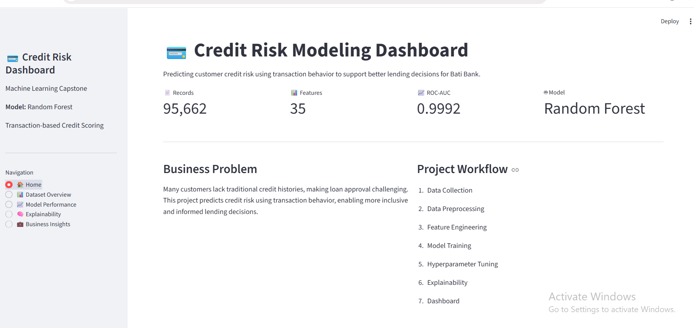
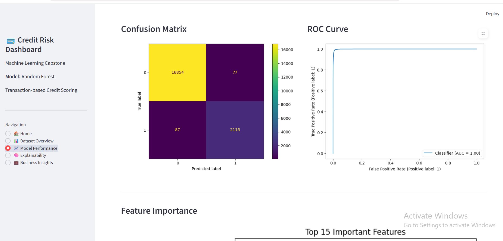

# Credit Risk Modeling for BNPL Service

# Credit Risk Modeling for Bati Bank


## Project Overview

Traditional credit scoring relies heavily on historical borrowing records, making it difficult for individuals with limited or no credit history to access financial services. This project develops a machine learning solution that predicts customer credit risk using transaction behavior as an alternative source of information.

The solution follows an end-to-end machine learning workflow, including data preprocessing, feature engineering, model training, hyperparameter tuning, explainability, automated testing, CI/CD, and an interactive Streamlit dashboard for communicating results.

---

## Business Problem

Bati Bank aims to expand access to credit while minimizing financial risk. Many customers lack sufficient credit history for conventional scoring methods, making loan decisions difficult.

This project addresses that challenge by using customer transaction data to identify high-risk and low-risk borrowers. The resulting model can support more informed lending decisions, improve consistency in credit assessment, and reduce potential default risk.

---

## Project Objectives

* Develop a reliable credit risk prediction model.
* Engineer meaningful customer transaction features.
* Compare multiple machine learning algorithms.
* Optimize model performance using hyperparameter tuning.
* Explain model predictions using SHAP.
* Present results through an interactive dashboard.
* Follow software engineering best practices for reproducibility and maintainability.

---

## Project Architecture

```text
Raw Transaction Data
        │
        ▼
Data Preprocessing
        │
        ▼
Feature Engineering (RFM)
        │
        ▼
Proxy Target Creation
        │
        ▼
Model Training & Evaluation
        │
        ▼
Hyperparameter Tuning
        │
        ▼
Model Explainability (SHAP)
        │
        ▼
Dashboard & API
```

---

## Repository Structure

```text
credit-risk-model/
│
├── app/
│   ├── dashboard.py
│   └── main.py
│
├── data/
│   ├── raw/
│   └── processed/
│
├── models/
│   └── random_forest.pkl
│
├── notebooks/
│
├── reports/
│   ├── metrics.json
│   ├── confusion_matrix.png
│   ├── roc_curve.png
│   ├── feature_importance.png
│   └── shap_summary.png
│
├── src/
│
├── tests/
│
├── requirements.txt
│
└── README.md
```

---

## Machine Learning Pipeline

The project consists of the following stages:

* Data preprocessing
* Missing value handling
* Feature engineering
* Customer aggregation
* Datetime feature extraction
* Proxy target creation using RFM clustering
* Model training
* Hyperparameter tuning with GridSearchCV
* Model evaluation
* Explainability using SHAP

---

## Model Performance

### Best Model

Random Forest Classifier

### Best Hyperparameters

| Parameter         | Value |
| ----------------- | ----: |
| n_estimators      |   200 |
| max_depth         |  None |
| min_samples_split |     2 |

### Evaluation Metrics

The dashboard automatically loads the evaluation metrics generated after model training.

Current metrics include:

* Accuracy
* Precision
* Recall
* F1-score
* ROC-AUC

---

## Explainability

Model predictions are explained using SHAP (SHapley Additive exPlanations).

The explainability module helps identify which features contribute most to customer credit risk predictions, increasing model transparency and supporting more informed lending decisions.

---

## Interactive Dashboard

The Streamlit dashboard provides:

* Project overview
* Dataset summary
* Model performance metrics
* Confusion matrix
* ROC curve
* Feature importance
* SHAP explainability
* Business insights

**dashboard screenshots .**
# Dashboard Preview

## 🏠 Home

<p align="center">
  
</p>

## 📈 Model Performance

<p align="center">
  
</p>

## 📊 Dataset Overview

<p align="center">
  
</p>

 
## Installation

Clone the repository:

```bash
git clone https://github.com/codequeen-11/credit-risk-model
cd credit-risk-model
```

Create a virtual environment:

```bash
python -m venv venv
```

Activate the environment:

**Windows**

```bash
venv\Scripts\activate
```

Install dependencies:

```bash
pip install -r requirements.txt
```

---

## Run the Project

Generate dashboard assets:

```bash
python src/generate_dashboard_assets.py
```

Generate SHAP visualizations:

```bash
python src/generate_shap_assets.py
```

Run the dashboard:

```bash
streamlit run app/dashboard.py
```

Run the API:

```bash
uvicorn app.main:app --reload
```

Run the tests:

```bash
pytest
```

---

## Technologies Used

* Python
* Pandas
* NumPy
* Scikit-learn
* MLflow
* Streamlit
* FastAPI
* SHAP
* Matplotlib
* Pytest
* GitHub Actions

---

## Future Improvements

* Deploy the dashboard to Streamlit Community Cloud.
* Containerize the application with Docker.
* Integrate the FastAPI backend with the dashboard for live predictions.
* Continuously retrain the model using newly available transaction data.
* Monitor model performance after deployment.

---

## Author

**Aisha Hussein**

Computer Science Graduate | Junior Machine Learning & AI Engineer | Full-Stack Developer

GitHub: https://github.com/codequeen-11
